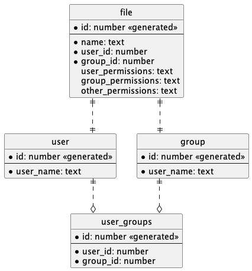

# Spring Boot 2 & 3 Tracing Demo

This demo is a multi-project showcasing how to perform tracing in Spring Boot 2
with Spring Cloud Sleuth and Spring Boot 3 with Micrometer Tracing.

The multi-project consists of the following subprojects:

- `common-interface`: Project containing communication classes used between
  a server and a client.
- `spring-boot-2-server`: A Spring Boot 2 server providing REST endpoints.
- `spring-boot-2-client`: A Spring Boot 2 client using a RestTemplate to
  query the Spring Boot 2 server.
- `spring-boot-3-server`: A Spring Boot 3 server providing REST endpoints.
- `spring-boot-3-client`: A Spring Boot 3 client using a RestTemplate to
  query the Spring Boot 3 server.

## Spring Sleuth API support in Spring Boot 3

Spring Boot 3.0.0 and Micrometer Tracing 1.0.0 do not support the Sleuth API 
annotations (@NewSpan, @ContinueSpan and @SpanTag). Support for these 
annotation was added in Spring Boot 3.1 and Micrometer Tracing 1.1.0.

For information about how to use these annotations, see [6.5. Aspect 
Oriented Programming (starting from Micrometer Tracing 1.1.0)](https://micrometer.io/docs/tracing#_aspect_oriented_programming_starting_from_micrometer_tracing_1_1_0).

If you need support for the Sleuth annotations but can not use Spring Boot 
3.1 or are waiting for a 3.1 GA release, see the branches 
`sleuth-aspect-code-copy`, `sleuth-aspect-manual-implementation` and 
`feature/micrometer-1.1.0-spring-boot-3.0.0` of this 
repository for some alternative solutions.

## Infrastructure

This project requires a tracing infrastructure with the following components
to be present:

- Grafana Loki
- Zipkin or Zipkin compliant distributed tracing system
- Prometheus

Inside the [docker-compose](docker-compose) folder two compose files exist to
start a tracing infrastructure with the following components:

- Grafana
- Grafana Loki
- Grafana Tempo
- Prometheus

## Database model

The domain is based on this model.



The model is documented as a PlantUML document here:
[database_model.puml](database_model.puml)

## Observation documentation documents

To take a look at the generated observation documentation documents the folder
[observation-documentation-documents](observation-documentation-documents)
has been pushed into the git history.

## Running the demo

Before starting the demo make sure that you started the infrastructure.

```sh
cd docker-compose
docker-compose -f docker-desktop.yml up -d
# or
docker-compose -f colima.yml up -d
```

To start the demo for a specific Spring Boot version run the following
gradle tasks.

```sh
# Spring Boot 2
gradlew :spring-boot-2-server:bootRun
gradlew :spring-boot-2-client:bootRun

# or

# Spring Boot 3
gradlew :spring-boot-3-server:bootRun
gradlew :spring-boot-3-client:bootRun
```

It is possible to start both Spring Boot 2 and Spring Boot 3 demos, since
all services run on different ports.

The client projects contain `http` files in `resources/http/` to run the demos.

If you want to clear the data in the docker postgres database you can run
the following scripts for each Spring Boot version respectively.

```sh
spring-boot-2-server/src/main/resources/db/cleanup/wipe-tables.sql
spring-boot-3-server/src/main/resources/db/cleanup/wipe-tables.sql
```

## Resources used to build this demo

Code:

* [Spring Boot - Production Ready features - 5. Observability](https://docs.spring.io/spring-boot/docs/3.0.0/reference/html/actuator.html#actuator.observability)
* [Spring Boot - Production Ready features - 7. Metrics](https://docs.spring.io/spring-boot/docs/current/reference/html/actuator.html#actuator.metrics.micrometer-observation)
* [Spring Boot - Production Ready features - 8. Tracing](https://docs.spring.io/spring-boot/docs/current/reference/html/actuator.html#actuator.micrometer-tracing)
* [Micrometer Tracing](https://micrometer.io/docs/tracing)
* [Micrometer Observation](https://micrometer.io/docs/observation)
* [Spring Blog - Observability with Spring Boot 3](https://spring.io/blog/2022/10/12/observability-with-spring-boot-3)
* [Spring Cloud Sleuth 3.1 Migration Guide](https://github.com/micrometer-metrics/tracing/wiki/Spring-Cloud-Sleuth-3.1-Migration-Guide)

Infrastructure:

* [Grafana Loki](https://grafana.com/docs/loki/latest/?pg=oss-loki&plcmt=quick-links)
* [Grafana](https://grafana.com/docs/grafana/latest/?pg=oss-graf&plcmt=quick-links)
* [Grafana Tempo](https://grafana.com/docs/tempo/latest/?pg=oss-tempo&plcmt=quick-links)
* [Prometheus](https://prometheus.io/docs/introduction/overview/)